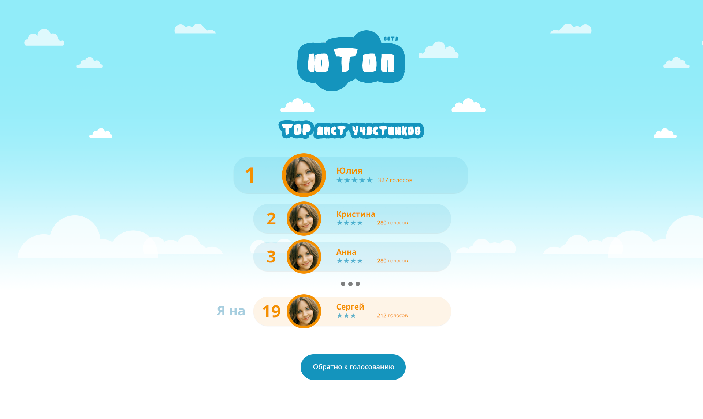

# Voter

Основано на идее из фильма **The Social Network**


## Основной функционал

### Авторизация


### Выбор фото


### Голосования


### Результаты



## Перед запуском

```
pyvenv-3.5 venv
source venv/bin/activate
pip install -r requirements.txt
```

Создать переменные окружения:

- **SECRET_KEY**
- **VK_OAUTH2_KEY**
- **VK_OAUTH2_SECRET**
- **DB_NAME**
- **DB_USER**
- **DB_PASSWORD**

### Создание бд и юзера

```
createuser --pwprompt voter_user
createdb -O voter_user -Eutf8 voter_db
```

Далее нужно накатить миграции

```
python manage.py migrate
```

## Использование API:

### Список участников
```
GET /casting-users/

http GET http://127.0.0.1:8000/casting-users/

HTTP/1.0 200 OK
Allow: GET, POST, HEAD, OPTIONS
Content-Type: application/json
Date: Tue, 17 May 2016 20:30:08 GMT
Server: WSGIServer/0.2 CPython/3.5.1
Vary: Accept, Cookie
X-Frame-Options: SAMEORIGIN

[
    {
        "counter": 0,
        "id": 2,
        "position": 2,
        "rating": 0,
        "stars": 0,
        "url": "http://new-new-photo.jpg"
    },
    {
        "counter": 0,
        "id": 8,
        "position": 2,
        "rating": 0,
        "stars": 0,
        "url": "http://new-photo12.jpg"
    }
]


```

### Просмотр конкретного участника
```
GET /casting-users/{pk}/

http http://127.0.0.1:8000/casting-users/2/

HTTP/1.0 200 OK
Allow: GET, PUT, PATCH, DELETE, HEAD, OPTIONS
Content-Type: application/json
Date: Tue, 17 May 2016 20:30:29 GMT
Server: WSGIServer/0.2 CPython/3.5.1
Vary: Accept, Cookie
X-Frame-Options: SAMEORIGIN

{
    "counter": 0,
    "id": 2,
    "position": 2,
    "rating": 0,
    "stars": 0,
    "url": "http://new-new-photo.jpg"
}

```
### Создание участника с выбранной фотографией
```
POST /casting-users/

http POST http://127.0.0.1:8000/casting-users/ url=http://new-photo12.jpg user=1

HTTP/1.0 201 Created
Allow: GET, POST, HEAD, OPTIONS
Content-Type: application/json
Date: Tue, 17 May 2016 20:25:47 GMT
Location: http://new-photo12.jpg
Server: WSGIServer/0.2 CPython/3.5.1
Vary: Accept, Cookie
X-Frame-Options: SAMEORIGIN

{
    "counter": 0,
    "id": 8,
    "position": 2,
    "rating": 0,
    "stars": 0,
    "url": "http://new-photo12.jpg",
    "user": 1
}

```
### Редактирование участника
```
PUT /casting-users/{pk}/
PATCH /casting-users/{pk}/

http PUT http://127.0.0.1:8000/casting-users/2/ url=http://new-new-photo.jpg

HTTP/1.0 200 OK
Allow: GET, PUT, PATCH, DELETE, HEAD, OPTIONS
Content-Type: application/json
Date: Tue, 17 May 2016 20:31:18 GMT
Server: WSGIServer/0.2 CPython/3.5.1
Vary: Accept, Cookie
X-Frame-Options: SAMEORIGIN

{
    "counter": 0,
    "id": 2,
    "position": 2,
    "rating": 0,
    "stars": 0,
    "url": "http://new-new-photo.jpg"
}

```

### Удаление участника
```
DELETE /casting-users/{pk}/

http DELETE http://127.0.0.1:8000/casting-users/1/

HTTP/1.0 204 No Content
Allow: GET, PUT, PATCH, DELETE, HEAD, OPTIONS
Content-Length: 0
Date: Tue, 17 May 2016 20:14:54 GMT
Server: WSGIServer/0.2 CPython/3.5.1
Vary: Accept, Cookie
X-Frame-Options: SAMEORIGIN


```

### Топ участников

```
GET /casting-users/top/

http GET http://127.0.0.1:8000/casting-users/top/

HTTP/1.0 200 OK
Allow: GET, HEAD, OPTIONS
Content-Type: application/json
Date: Tue, 17 May 2016 20:31:45 GMT
Server: WSGIServer/0.2 CPython/3.5.1
Vary: Accept, Cookie
X-Frame-Options: SAMEORIGIN

[
    {
        "counter": 0,
        "id": 2,
        "info": {
            "first_name": "Лев"
        },
        "rating": 0,
        "stars": 0,
        "url": "http://new-new-photo.jpg"
    },
    {
        "counter": 0,
        "id": 8,
        "info": {
            "first_name": ""
        },
        "rating": 0,
        "stars": 0,
        "url": "http://new-photo12.jpg"
    }
]

```
